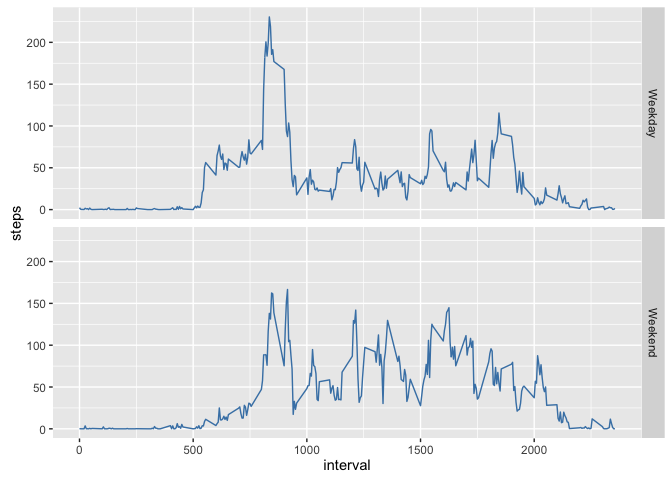

# Reproducible Research: Peer Assessment 1

This assignment makes use of data from a personal activity monitoring device. This device collects data at 5 minute intervals through out the day. The data consists of two months of data from an anonymous individual collected during the months of October and November, 2012 and include the number of steps taken in 5 minute intervals each day.

### Loading and preprocessing the data
The data is stored in a zip file in our directory, so we will unzip it if we haven't already, and load it into a variable called `activity`.  

```r
library(lubridate)
library(dplyr)

if (!exists('activity.csv')) {
    unzip('activity.zip')
}

activity <- read.csv('activity.csv')

head(activity)
```

```
##   steps       date interval
## 1    NA 2012-10-01        0
## 2    NA 2012-10-01        5
## 3    NA 2012-10-01       10
## 4    NA 2012-10-01       15
## 5    NA 2012-10-01       20
## 6    NA 2012-10-01       25
```

```r
str(activity)
```

```
## 'data.frame':	17568 obs. of  3 variables:
##  $ steps   : int  NA NA NA NA NA NA NA NA NA NA ...
##  $ date    : Factor w/ 61 levels "2012-10-01","2012-10-02",..: 1 1 1 1 1 1 1 1 1 1 ...
##  $ interval: int  0 5 10 15 20 25 30 35 40 45 ...
```

Our data frame has three columns, `steps`, which counts the number of steps in the interval, `date`, which is the date on which the data was recorded, and `interval`, which is the five-minute interval during which the data was recorded. Right now our dates are factors. Let's change them to `POSIXct` format.


```r
activity <- transform(activity, date = ymd(date))
str(activity)
```

```
## 'data.frame':	17568 obs. of  3 variables:
##  $ steps   : int  NA NA NA NA NA NA NA NA NA NA ...
##  $ date    : POSIXct, format: "2012-10-01" "2012-10-01" ...
##  $ interval: int  0 5 10 15 20 25 30 35 40 45 ...
```


### What is mean total number of steps taken per day?

We are intersted in daily data. We will find the total steps taken on each day and create a histogram with binwidth of $1000$.


```r
library(ggplot2)

stepsByDay <- aggregate(steps ~ date, data = activity, FUN = sum, na.rm = TRUE)

ggplot(stepsByDay, aes(steps)) + 
    geom_histogram(binwidth = 1000, center = 500, color = 'steelblue', 
                   fill = 'steelblue', alpha = .75)
```


By our histogram, we can tell that the total number of steps taken each day is somewhat normally distributed. The mean should hover around $10000$. 


```r
summarise(stepsByDay, mean = mean(steps), median = median(steps))
```

```
##       mean median
## 1 10766.19  10765
```

### What is the average daily activity pattern?

Let's visualize what the average day looks like in terms of steps taking. What we're doing here is finding the mean of each interval, then creating a time series plot. 


```r
stepsByInt <- aggregate(steps ~ interval, data = activity, FUN = mean, na.rm = TRUE)

ggplot(stepsByInt, aes(interval, steps)) + 
    geom_line(color = 'steelblue')
```


It looks like, aside from that surge between 8:00 and 9:00, there is consistent movement of $20$ to $100$ steps for every 5-minute interval between 5:00 and 19:00. 


```r
stepsByInt[which.max(stepsByInt$steps),]
```

```
##     interval    steps
## 104      835 206.1698
```

On average, the most steps are taken around 8:35 am. 

### Imputing missing values
As we saw above, we have 2304 `NA` values in our steps column. This is over 10% of our data, so it can have an effect on our distribution values. We are going to impute missing values. There are several ways to do this, but we are going to insert the mean value for the interval.

Let's create a `intervalMean` column for the `activity` data frame. This column will just list the mean of the interval in question.

```r
meanInt <- ave(activity$steps, as.factor(activity$interval), 
               FUN = function(x) mean(x,na.rm=TRUE))

activity <- mutate(activity, intervalMean = meanInt)

head(activity)
```

```
##   steps       date interval intervalMean
## 1    NA 2012-10-01        0    1.7169811
## 2    NA 2012-10-01        5    0.3396226
## 3    NA 2012-10-01       10    0.1320755
## 4    NA 2012-10-01       15    0.1509434
## 5    NA 2012-10-01       20    0.0754717
## 6    NA 2012-10-01       25    2.0943396
```

Now we will let steps be equal to `intervalMean` if there is an `NA` value.


```r
actComplete <- mutate(activity, steps = ifelse(is.na(steps), intervalMean, steps))
head(actComplete)
```

```
##       steps       date interval intervalMean
## 1 1.7169811 2012-10-01        0    1.7169811
## 2 0.3396226 2012-10-01        5    0.3396226
## 3 0.1320755 2012-10-01       10    0.1320755
## 4 0.1509434 2012-10-01       15    0.1509434
## 5 0.0754717 2012-10-01       20    0.0754717
## 6 2.0943396 2012-10-01       25    2.0943396
```

```r
summary(actComplete$steps)
```

```
##    Min. 1st Qu.  Median    Mean 3rd Qu.    Max. 
##    0.00    0.00    0.00   37.38   27.00  806.00
```

For completeness, let's delete the `intervalMean` column.


```r
actComplete$intervalMean <- NULL
head(actComplete)
```

```
##       steps       date interval
## 1 1.7169811 2012-10-01        0
## 2 0.3396226 2012-10-01        5
## 3 0.1320755 2012-10-01       10
## 4 0.1509434 2012-10-01       15
## 5 0.0754717 2012-10-01       20
## 6 2.0943396 2012-10-01       25
```


```r
stepsByDayComplete <- aggregate(steps ~ date, data = actComplete, FUN = sum)

ggplot(stepsByDayComplete, aes(steps)) + 
    geom_histogram(binwidth = 1000, center = 500, color = 'steelblue', 
                   fill = 'steelblue', alpha = .75)
```


```r
summarise(stepsByDayComplete, mean = mean(steps), median = median(steps))
```

```
##       mean   median
## 1 10766.19 10766.19
```

Daily step totals became more concentrated in the center. The mean step total remained the same, and the median step total converged to the mean. 

### Are there differences in activity patterns between weekdays and weekends?

Let's checkout some differences between weekday and weekend activity patterns. 

```r
library(timeDate)

actComplete <- mutate(actComplete, dayType = ifelse(isWeekday(date), 'Weekday', 'Weekend'))

completeByWeekday <- aggregate(steps ~ interval * dayType, 
                               data = actComplete, FUN = mean)

ggplot(data = completeByWeekday, aes(interval, steps)) +
    geom_line(color = 'steelblue') +
    facet_grid(dayType ~ .)
```



```r
group_by(completeByWeekday, dayType) %>% 
    summarise(mean = mean(steps), median = median(steps))
```

```
## Source: local data frame [2 x 3]
## 
##   dayType     mean   median
##     (chr)    (dbl)    (dbl)
## 1 Weekday 35.61058 25.80314
## 2 Weekend 42.36640 32.33962
```

Our subject does show a difference in activity patterns on the weekends. There isn't as extreme of a peak, but the steps per interval stays consistantly high.
